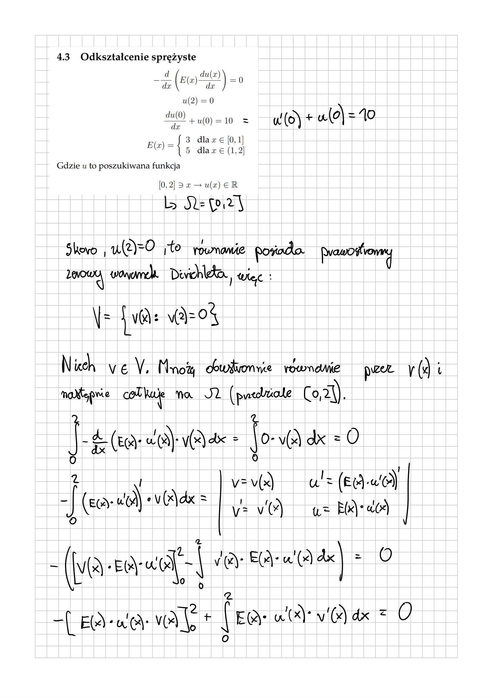
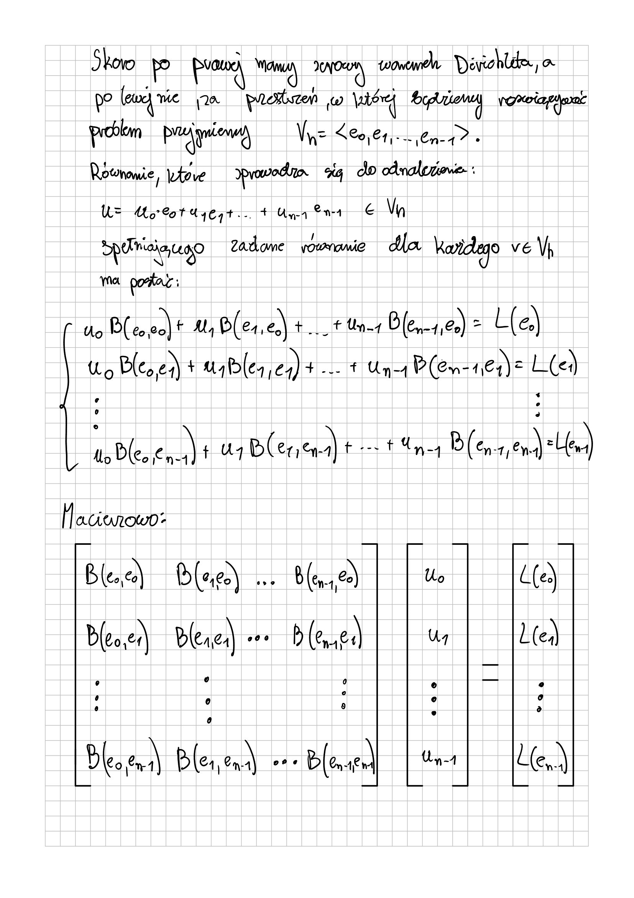

# Finite_Elements_Method_elastic_deformation
Rozwiazanie zostało zaprezentowane za pomocą skryptu MATLAB
# Wyprowadzenie Sformułowania Wariacyjnego

Poniżej znajduje się bezpośredni podgląd pliku **"Wyprowadzenie Sformułowania Wariacyjnego"**.

[**Kliknij tutaj, aby otworzyć plik PDF w nowej karcie**](./wyprowadzenie_sformułowania_wariacyjnego.pdf)

